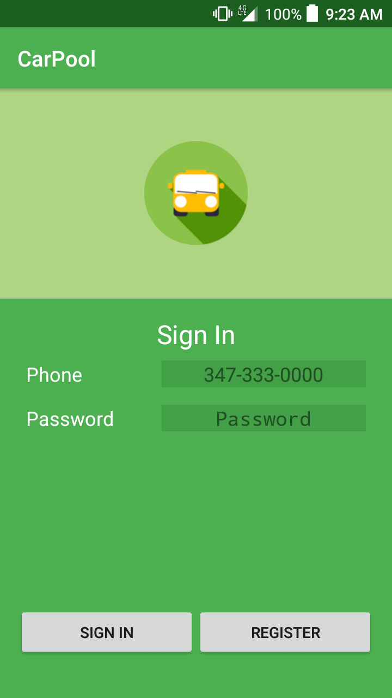
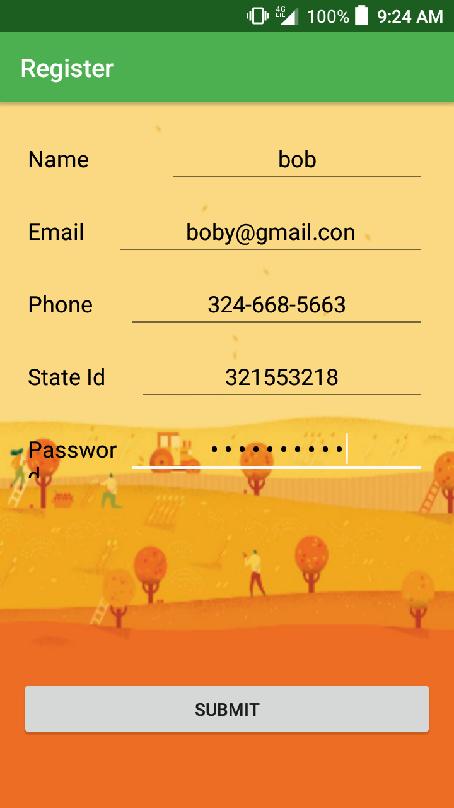
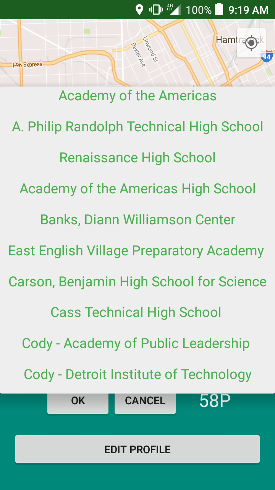
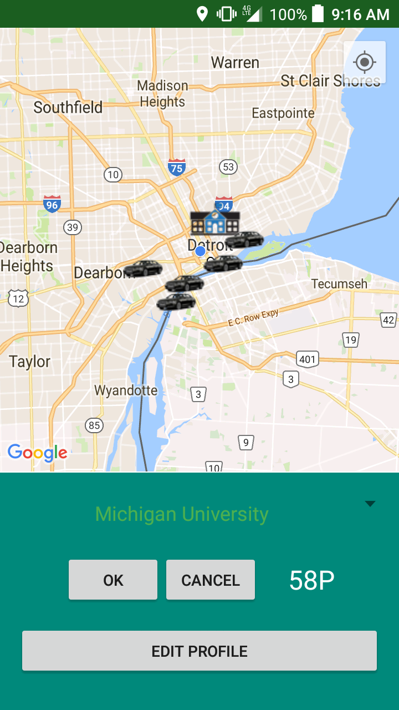
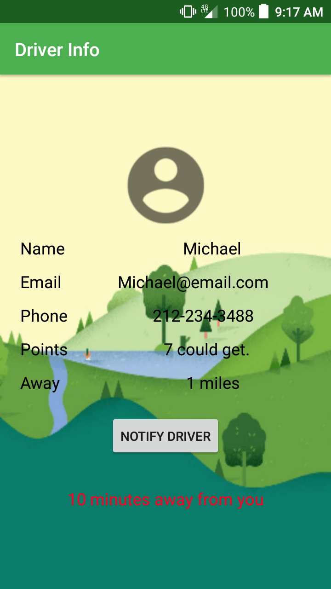
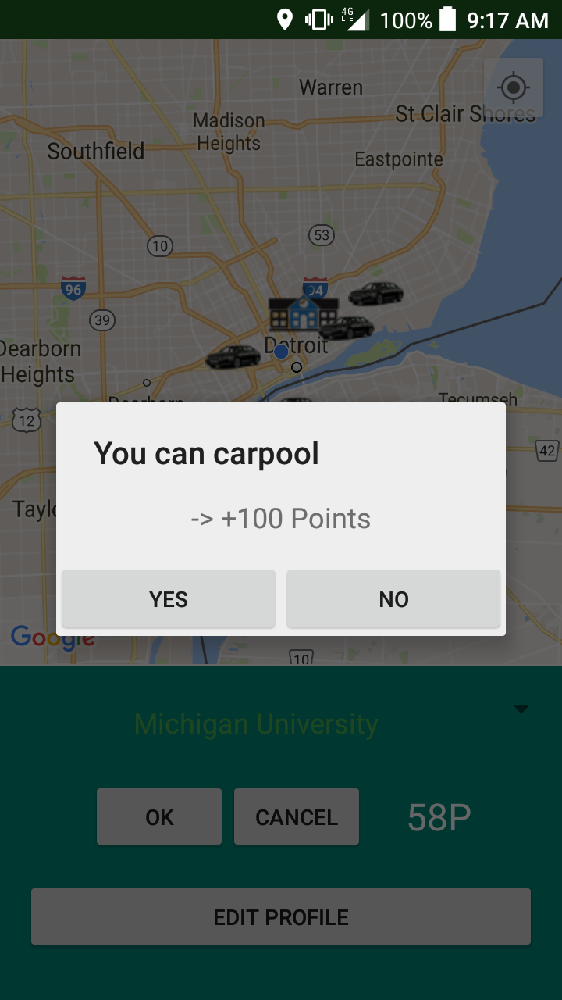
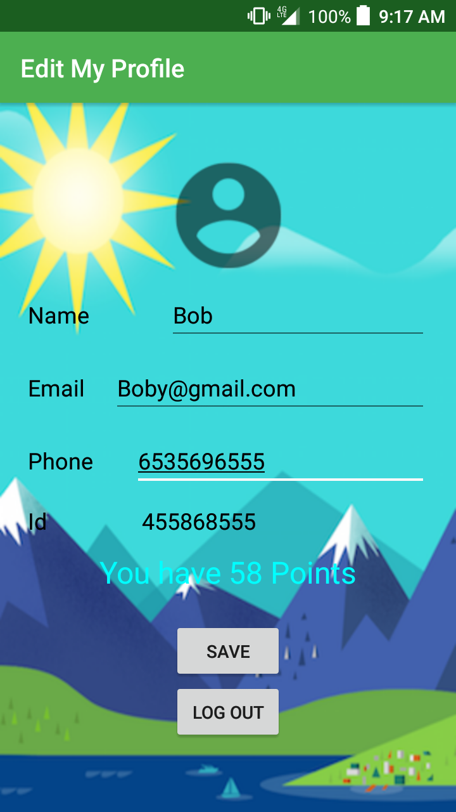

# Carpool
Android app to make everybody to stay connected with tansit and help each other getting some benefits.

## It Uses
* Amazon cloud storage as web server to store peoples data and location points
* Google Maps API v2
* Universities Data from Resources given
* Mathematical analisys to get priority distance and places.

#### Sign in
* Log in with your account if you have one already

### Register
* You must create an account to verify your identity and drivers identity for safetity purposes.

### Choose a place 
* You can pick a place where you want to go and see drivers around that might be going to the same place

### Look for a car
* Look for someone that is going to the same direction that you are going.

### Look for driver info
* You can look for the driver info and be safe, you can also see how many minutes he will get to you, request his help, his number

### Become a pool
* Becoming a pool means to help people and not only that, you could get coupons/gift cards for certain points you get depending on the miles you help.

### Edit your profile
* After verified you can edit your profile changing profile picture, username, phonenumber or even password.

